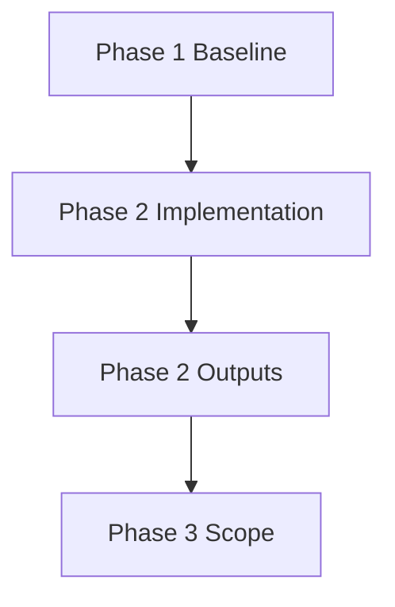

# Phase 2 Summary

> [!summary]
> 이 노트는 `rfic_project`의 Phase 2 작업 결과를 Obsidian에 정리하기 위한 템플릿이다.
> Phase 2 결과물 확인 후 구현 기능, 변경 파일, 설계 결정, 검증 결과, Phase 3 연결 항목을 채운다.

## Context

- Project: [[rfic_project]]
- Related README: [[README]]
- Previous phase: [[Phase1_Summary]]
- Next phase: [[Phase3_Plan]]
- Date: 2026-06-03

## Phase 2 Goal

```text
Phase 2 목표:
- TODO: Phase 2에서 달성하려던 핵심 목표를 적는다.
- TODO: README 또는 기존 계획 문서의 요구사항과 연결한다.
```

## Implemented Features

### 1. Core Feature

- Summary: TODO
- Entry points: TODO
- User/developer impact: TODO
- Verification evidence: TODO

### 2. Supporting Feature

- Summary: TODO
- Entry points: TODO
- User/developer impact: TODO
- Verification evidence: TODO

### 3. Integration / Workflow

- Summary: TODO
- Entry points: TODO
- User/developer impact: TODO
- Verification evidence: TODO

## Changed Files

| File | Role | Phase 2 Notes |
| --- | --- | --- |
| `TODO` | TODO | TODO |
| `TODO` | TODO | TODO |
| `TODO` | TODO | TODO |

## Architecture Notes



### Design Decisions

- Decision: TODO
  - Reason: TODO
  - Tradeoff: TODO
  - Rejected alternative: TODO

- Decision: TODO
  - Reason: TODO
  - Tradeoff: TODO
  - Rejected alternative: TODO

## Validation

```bash
# Commands run during or after Phase 2
TODO
```

### Results

- Passing checks: TODO
- Known gaps: TODO
- Risks carried into Phase 3: TODO

## Phase 3 Handoff

### Scope Candidates

- [[Phase3_Plan#Scope]]: TODO
- [[Phase3_Plan#Implementation]]: TODO
- [[Phase3_Plan#Validation]]: TODO

### Dependencies

- Existing Phase 2 outputs to preserve:
  - `TODO`
- Phase 3 should add new code in separated paths:
  - `TODO`

### Open Questions

- TODO

## Prompt For Future Summary Completion

```text
Analyze rfic_project's README, git history, existing code, and Phase 2 outputs.
Fill this Obsidian note with:
1. Phase 2 implemented features
2. Changed file list and each file's role
3. Design decisions and rejected alternatives
4. Validation evidence
5. Phase 3 handoff scope with links to [[Phase3_Plan]]

Keep existing Phase 2 code intact. Prefer concrete file references and concise decision records.
```
