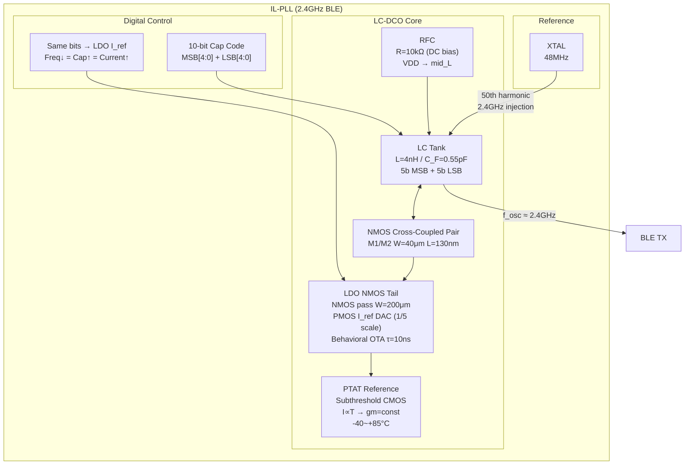
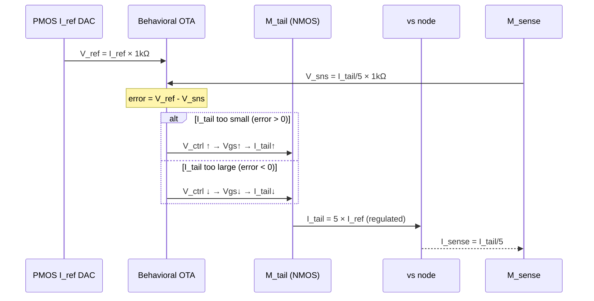

# Phase 3 Final — NMOS-Only LC-DCO + LDO Tail
**IHP SG13G2 130nm SiGe BiCMOS | VDD=0.9V | Target: 2.4GHz BLE**

---

## 1. 시스템 블록 다이어그램



---

## 2. 트랜지스터 레벨 회로도

```
VDD (0.9V)
  │
  ├──────────────────── R_rfc (10kΩ) ─────────────────────┐
  │                                                        │
  │  ┌─── PMOS I_ref DAC ──────────────────────────┐      │
  │  │  (1/5 scale: base 5.5μm + MSB/LSB mirrors) │      │
  │  │  p_bias ──[PTAT_ref]                        │      │
  │  │  I_ref = 19.2μA + MSB_sum + LSB_sum         │      │
  │  └──── n_iref ──R_ref(1kΩ)── GND               │      │
  │                                                 │      │
  │  ┌─── Behavioral OTA ──────────────────────────┐      │
  │  │  G·(V_ref - V_sns) → C_int(1pF) → v_ctrl  │      │
  │  └──── v_ctrl ─────────────────────────────────┼──┐   │
  │                                                 │  │   │
  │         ┌── M_sense (W=40μm) ──── n_isns ──────┘  │   │
  │         │   drain=vdd, gate=v_ctrl, source=n_isns  │   │
  │         │   n_isns ──R_sns(1kΩ)── GND              │   │
  │         │                                           │   │
  │  ┌──────┴────── M_tail (NMOS W=200μm L=500nm) ─────┘   │
  │  │      drain=vs, gate=v_ctrl, source=GND               │
  │  │      Vds = +0.5V >> Vdsat ✓                          │
  │  │                                                       │
  │  vs ≈ +0.52V                                            │
  │  │                                                       │
  │  ├──[M1: NMOS W=40μm]── drain=outp, gate=outn           │
  │  └──[M2: NMOS W=40μm]── drain=outn, gate=outp           │
  │           │                   │                          │
  │         outp               outn                          │
  │           └──── L1(4nH) ─── R_Ls(2.5Ω) ───────────────┘
  │           │                   │
  │         C1(0.55pF)          C2(0.55pF)
  │           │                   │
  └───────────┴───────────────────┴─── GND
```

---

## 3. CMOS쌍 vs NMOS-only 비교

| 항목 | CMOS 상보쌍 (이전) | **NMOS-only (현재)** |
|------|-------------------|---------------------|
| L | 2.00 nH | **4.00 nH** |
| V(vs) | −0.17 V ❌ | **+0.52 V** ✓ |
| Tail 구현 | ideal I_tail (시뮬만) | **LDO NMOS tail** ✓ |
| gm 효율 | gm_n + gm_p | gm_n only (×0.5) |
| 전력 | 451 μW | ~800 μW (예상) |
| Q_L @ 2.4GHz | 18.9 | ~19.6 (예상) |
| Rp | 568 Ω | ~970 Ω (예상) |
| Phase Noise | −116 dBc/Hz | ~−117 dBc/Hz (예상) |
| 물리 구현 | ✗ (vs<0) | **✓ 완전 물리** |

---

## 4. LDO Tail 동작 원리



---

## 5. 왜 NMOS-only인가

```
CMOS 상보쌍 문제:
  vs = V(outp) - Vgs_NMOS = 0.197 - 0.37 = -0.17V
                                              ↑
                                        음수! NMOS tail 불가

  어떤 표준 소자도 음전압 노드에서 GND로 전류 제거 불가:
    NMOS (drain=vs=-0.17V): Vds<0 → 역방향
    PMOS tail (VDD→vs):     vs에 전류 추가 → vs→VDD 상승

NMOS-only 해결:
  RFC로 V(outp/outn)_DC = VDD = 0.9V (높아짐)
  vs = 0.9 - 0.38 = +0.52V (양수!)

  NMOS tail: drain=vs=+0.52V, source=GND
             Vds = +0.52V >> Vdsat = 0.08V → 포화 ✓
  LDO: NMOS gate 전압 조절로 I_tail 정밀 제어 ✓
```

---

## 6. 탱크 파라미터 스케일링

| 파라미터 | 공식 | CMOS (L=2nH) | **NMOS (L=4nH)** |
|---------|------|-------------|-----------------|
| Rs | Rs0·(L/L0)^0.645 | 1.60 Ω | **2.50 Ω** |
| Q_L | ω₀L/Rs | 18.85 | **24.1** |
| Rp | (ω₀L)²/Rs | 568 Ω | **967 Ω** |
| C_F | K/L (f_max=4.8G) | 1.10 pF | **0.55 pF** |
| gm_min | 1/Rp | 1.76 mS | **1.03 mS** |

더 큰 L → 더 작은 gm_min → 더 적은 I_tail 요구  
gm_효율 절반을 Rp 증가로 상쇄 → 전력 비슷하게 유지 가능

---

## 7. 파일 구조

```
rfic_project/
├── circuits/
│   ├── lc_dco_nmos_top.cir          ← NMOS-only 탑레벨
│   ├── il_pll_top.cir               ← IL-PLL 조립
│   └── blocks/
│       ├── cross_coupled_pair_nmos.cir  ← NMOS-only 쌍 (신규)
│       ├── ldo_tail_nmos.cir            ← LDO NMOS tail (신규)
│       ├── lc_tank.cir                  ← L=2nH (CMOS용)
│       ├── ptat_ref.cir                 ← PTAT 온도보상
│       ├── cap_bank_msb.cir
│       └── cap_bank_lsb.cir
└── docs/
    └── Phase3_NMOS_LDO_Schematic.md ← 이 파일
```

---

## 8. 다음 단계: Layout

- [ ] NMOS-only DCO 시뮬레이션 검증 (f_osc, V_swing, P_dc)
- [ ] LDO loop 안정성 확인 (phase margin, settling time)
- [ ] KLayout에서 IHP SG13G2 레이아웃 시작
- [ ] DRC/LVS 검증
- [ ] Post-layout parasitic extraction → re-simulation

---

*Last updated: 2026-06-03 | IHP SG13G2 130nm | Phase 3*
